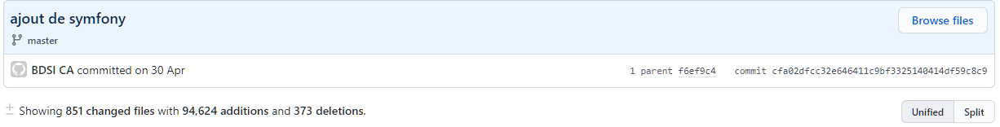

# Campus_Contest_Application

### **Composition du groupe** :
Killian Ronvel (Bufaloo)
Nicolas Hamy (NicolasHAMY)
Simon Bourrasseau (simonbourrasseau)
Margaux Dechaud (PseudoSerieux )

Application Coincoins Insolites faite en Ionic.

Utilisation d’Azure DevOps pour la gestion du projet (https://dev.azure.com/killianronvel/Coincoin%20Insolite)

### **But de l'application** :
- Accompagner les utilisateurs dans leurs randonnées

- Permettre de prendre des photos géolocalisées

- Proposer des lieux insolites avec des photos

### **But du site web** :
- Promotion de l'application

- Permet son téléchargement

- Proposer des lieux insolites avec des photos

- Permet un échange avec le site

- Le projet se doit d'être intuitif, accessible en français comme en anglais et adapté aux différentes conditions d'utilisations.

### **Pré-requis pour l'installation** :
```
- npm install firebase @angular/fire --save (Base de donnée)
```

## **Les problèmes rencontrés** :

#### Côté Application :

- API Google Maps devenue inaccessible au bout de quelque temps, et impossibilité de la récupérer. Ce qui nous a obligé de changer toute la map vers Leaflet. 
- Librairie de mapping Obsolète.  
- Récupération et insertions des coordonnées GPS des randonnées pour le traçage de celles-ci.
- Importation Data randonnées directement en BDD.
- Donner l’accès Firebase aux autres membres du groupe.
- Manque de connaissance en Ionic et firebase.


#### Côté Site :

- Camarade chargé du back dans le type 3 (ghostbuster) on a jamais eu de ses nouvelles.
- Un commit datant du 30 avril (#cfa02dfcc32e646411c9bf3325140414df59c8c9) a été effectué par un bot sur la branche master et a écrasé toute l’avancée du site : index & page de contact / css / images inclus.



- Techno utilisées par l’équipe changées trop de fois : Vuejs, Reactjs, Symfony...


## **Solutions** :

#### Côté Application :

- Réfléchir à la meilleure solution et aux avantages et inconvénients de chaque API de map existante avant de choisir la première venu.
- Configurer proprement notre base de donnée avant l’utilisation de celle-ci.
- Utilisation Docker
- Utiliser au mieux les bonnes pratiques de Ionic.

#### Côté Site :

- A l’avenir pour prévenir ce genre de problèmes il serait sage d’octroyer les droits de modifications, que ce soit push/merge/créer des branches, sur master qu’à une ou deux personnes (le créateur du repo & un tiers compétent avec Git)
- Nous pourrions nous fixer, tant côté site qu'application, sur une seule techno que l’on utilise/monte en compétence pour garantir un travail continue et stable.
